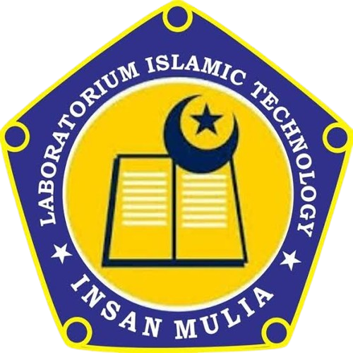

<p align="center">
  
</p>

<h1 align="center">SDIT Labitech Insan Mulia</h1>
<p align="center">Sistem Informasi Sekolah Dasar Islam Terpadu</p>

---

## 🚀 Tentang Proyek

Website resmi **SDIT Labitech Insan Mulia** yang mencakup:

- Landing page sekolah (Beranda, Tentang Kami, Berita, Kontak)
- Pendaftaran Siswa Baru (PPDB) & Siswa Pindahan
- Portal Siswa (login & dashboard)
- Panel Admin (manajemen data siswa)
- Sistem login terpadu (Unified Login) untuk Siswa & Admin

## 📋 Persyaratan

- PHP >= 8.2
- Composer
- MySQL / MariaDB
- Node.js & NPM (untuk asset compilation)
- Laragon (rekomendasi untuk Windows)

## ⚙️ Instalasi

```bash
# Clone repository
git clone <repo-url> sekolah
cd sekolah

# Install dependencies
composer install
npm install

# Setup environment
cp .env.example .env
php artisan key:generate

# Konfigurasi database di .env lalu jalankan:
php artisan migrate
php artisan db:seed

# Build assets & jalankan server
npm run build
php artisan serve
```

## 🔐 Akun Login

### 👨‍💼 Admin (Login sebagai Admin)

| Username        | Email                  | Password       |
| --------------- | ---------------------- | -------------- |
| `labitech`      | admin@labitech.sch.id  | `secret123`    |
| `kepalasekolah` | kepsek@labitech.sch.id | `labitech2026` |
| `tatausaha`     | tu@labitech.sch.id     | `admin12345`   |

### 🎓 Siswa (Login sebagai Siswa)

| Nama           | Username        | NISN         | Email                       | Password   |
| -------------- | --------------- | ------------ | --------------------------- | ---------- |
| Ahmad Fauzi    | `ahmadfauzi`    | `1234567890` | ahmad@siswa.labitech.sch.id | `siswa123` |
| Siti Nurhaliza | `sitinurhaliza` | `0987654321` | siti@siswa.labitech.sch.id  | `siswa123` |

> **Catatan:** Siswa bisa login menggunakan **NISN**, **Username**, atau **Email**.

### 🔄 Cara Seed Ulang Akun

```bash
# Seed ulang data (PERHATIAN: akan menimpa data lama)
php artisan db:seed --class=AdminSeeder
php artisan db:seed --class=StudentSeeder
php artisan db:seed --class=NewsSeeder
```

## 🌐 Halaman Utama

| Halaman                | URL                     |
| ---------------------- | ----------------------- |
| Beranda                | `/`                     |
| Tentang Kami           | `/about`                |
| Berita                 | `/news`                 |
| Kontak                 | `/contact`              |
| Pendaftaran Siswa Baru | `/pendaftaran`          |
| Pendaftaran Pindahan   | `/pendaftaran-pindahan` |
| Login (Unified)        | `/login`                |
| Daftar Akun Siswa      | `/student-register`     |

## 🛠️ Tech Stack

- **Framework:** Laravel 11
- **Frontend:** Blade, Bootstrap 5, Font Awesome 6
- **Font:** Poppins (Google Fonts)
- **Database:** MySQL
- **Auth:** Multi-guard (Admin + Students)

## � Memindahkan Project ke USB

Project ini bisa diperkecil dari **~110 MB** menjadi **~3-5 MB** dengan menghapus folder yang bisa di-install ulang.

| Folder              | Ukuran  | Di-copy?                                 |
| ------------------- | ------- | ---------------------------------------- |
| `vendor/`           | ~62 MB  | ❌ Skip (install via `composer install`) |
| `node_modules/`     | ~46 MB  | ❌ Skip (install via `npm install`)      |
| `storage/logs`      | ~1 MB   | ❌ Skip                                  |
| Sisa (kode project) | ~3-5 MB | ✅ Copy                                  |

### Cara Cepat (Windows)

Double-click file `copy-to-usb.bat`, masukkan huruf drive USB (misal: `E`), selesai.

### Cara Manual

```bash
# Copy semua KECUALI vendor, node_modules, .git
robocopy "g:\laragon\www\sekolah" "E:\sekolah" /E /XD vendor node_modules .git storage\logs
```

### Menjalankan di PC Lain

```bash
cd E:\sekolah
composer install
npm install
cp .env.example .env
php artisan key:generate
php artisan migrate --seed
npm run build
php artisan serve
```

## �📄 License

Open-sourced software licensed under the [MIT license](https://opensource.org/licenses/MIT).
